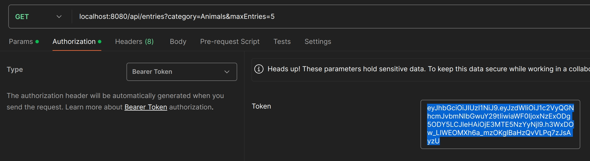
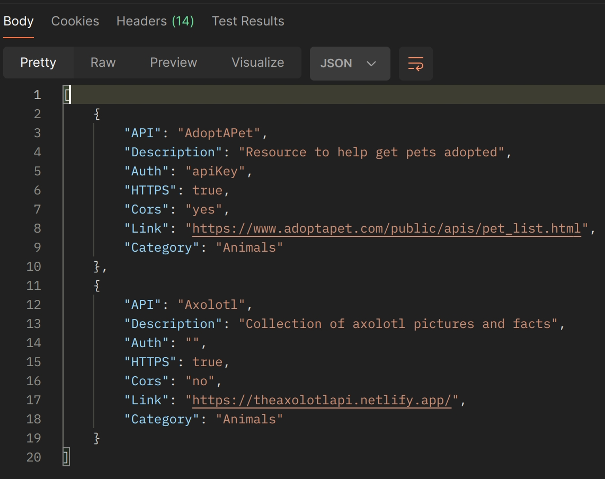
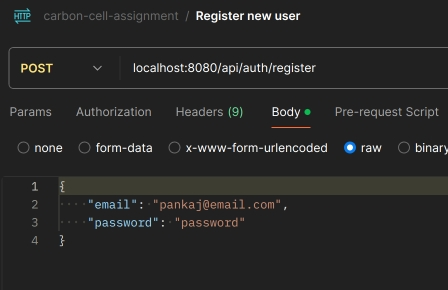
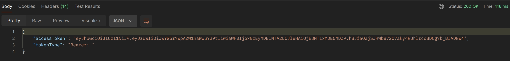
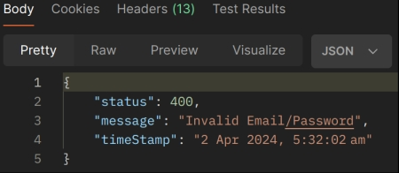

# User Authentication and API Development with JWT, Spring Boot, and Swagger

This project demonstrates the implementation of user authentication using JWT (JSON Web Tokens), creation of API endpoints for data retrieval from a public API with filtering options, and documenting the API endpoints using springdoc-OpenAPI (Swagger UI).
It also includes securing API endpoints for authenticated users only.

## Technologies Used

- Java 22
- Spring Boot
- Spring Security
- JWT (JSON Web Tokens)
- springdoc OpenAPI

## Prerequisites

Before running the application, ensure you have the following installed:

- Java Development Kit (JDK)
- Maven
- Postman or any internet browser

## Getting Started

To run the application, follow these steps:

1. Clone the repository:

   ```
   git clone https://github.com/Pankaj-dev98/carbon-cell-assignment-2APR2024.git
   ```

2. Navigate to the project directory:

   ```
   cd carbon-cell-assignment
   ```

3. Build the project:

   ```
   mvn clean install
   ```

4. Run the application:

   ```
   mvn spring-boot:run
   ```

## Task 1: User Authentication with JWT

### Endpoints:
#### These endpoints are accessible by non-authenticated users. They act as an entry-point to this project.
- `/api/auth/register` (POST): Registers a new user.
- `/api/auth/login` (POST): Authenticate a user and generate JWT token.
- `/docs.html` (GET): Swagger UI landing page.

### Secured Routes:

- `/api/entries` (GET): Example protected route requiring authentication.

## Task 2: API Endpoints for Data Retrieval

### Endpoints:

- `/api/data` (GET): Fetches data from the public API (https://api.publicapis.org/entries) with filtering options for categories and result limits.
- This endpoint accepts two parameters in the URL: `category` and `maxEntries`.
    - `maxEntries` is an integers that limits the number of entries sent to the client. It is optional and if not supplied, defaults to sending all JSON objects received by the request.
    - `category` is a string which filters the JSON objects received from the public API. It is case-insensitive. An example of the request and the subsequent response are as follows:
    
    #### Request:
    
    #### Response:
    
    

## Task 3: Swagger Documentation

### Access Swagger UI:

Swagger UI can be accessed at `http://localhost:8080/docs.html` after running the application.

## Task 4: Secure API Endpoint for Authenticated Users Only

### Secured Endpoint:

- `/api/data?category={CATEGORY}&maxEntries={MAX_ENTRIES}` (GET): Restricted access to authenticated users with a valid JWT token only.

## Testing

1. Register a new user using `/api/auth/register`. This endpoint only accepts valid email addresses and responds with code 200(OK) if the user was registered successfully. An email address may only register once in this application and an attempt to register an existing email address fails.
   #### An example of a successful email registration:
   
2. Authenticate the user and obtain JWT token using `/api/auth/login`. This endpoint responds with a JWT token that is valid for 24hr(post creation) in a Json body,
   in the `accessToken` string.
   
3. Use the generated token to access the protected endpoint using the supplied JWT token.
4. The API can be tested exhaustively using the swagger UI or, Postman or any other API testing tool.

## Error Handling

The application includes error handling for invalid requests, authentication failures, and unauthorized access attempts.
All error respond with appropriate Http status codes and a Json object detailing the failure.

## Contributors

- Pankaj Kalra (Pankaj.kalra634@gmail.com)